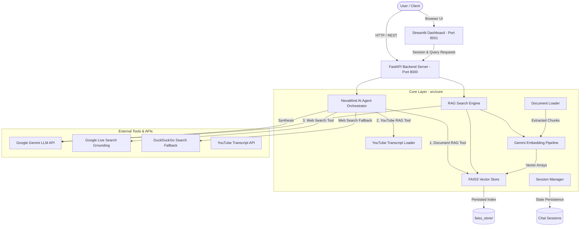

# 📋 Standard Operating Procedure (SOP)
## NexaMind Autonomous RAG Intelligence Platform

**Document Version:** 1.0.0  
**Project:** NexaMind RAG Intelligence Platform  
**Target Audience:** DevOps Engineers, Software Engineers, AI/ML Operators, System Administrators  
**Last Updated:** August 2026  

---

## 🎯 1. Objective & Scope

This Standard Operating Procedure (SOP) defines the operational guidelines, system architecture, environment setup, deployment processes, API usage, and maintenance procedures for the **NexaMind RAG Intelligence Platform**.

NexaMind is a production-grade **Retrieval-Augmented Generation (RAG)** platform and **Autonomous AI Agent** framework powered by Python, FAISS vector indexing, Google Gemini Embeddings (`gemini-embedding-001`), Google Gemini LLMs (`gemini-2.0-flash`), FastAPI REST endpoints, and an interactive Streamlit UI dashboard.

---

## 🏗️ 2. System Architecture & Component Mapping

### 2.1 Architecture Diagram



### 2.2 Directory Structure & Component Responsibility

| File / Folder | Purpose & Operational Role |
| :--- | :--- |
| `app.py` | Central application launcher CLI (`--backend`, `--frontend`, `--all`, `--query`). |
| `src/config.py` | Centralized settings management (Pydantic-backed environment loader). |
| `src/core/agent.py` | Autonomous AI agent orchestrator routing queries to tools. |
| `src/core/document_loader.py` | Multi-format document ingestion engine (PDF, TXT, CSV, XLSX, DOCX, JSON). |
| `src/core/youtube_loader.py` | YouTube transcript fetching and dataset ingestion. |
| `src/core/embeddings.py` | Text chunking (`RecursiveCharacterTextSplitter`) & Gemini vector embedding. |
| `src/core/vectorstore.py` | FAISS index management, persistence, and L2 similarity search. |
| `src/core/search_engine.py` | End-to-end RAG retrieval, context formatting, and LLM answer generation. |
| `src/core/session_manager.py` | Multi-session chat memory management and session persistence. |
| `src/core/tools.py` | Tool definitions for Agent orchestration (`document_rag`, `youtube_rag`, `web_search`). |
| `src/api/main.py` | FastAPI application entry point and OpenAPI docs host. |
| `src/api/routes/` | REST routers (`health`, `rag`, `sessions`, `documents`, `youtube`, `agent`). |
| `src/ui/app.py` | Streamlit glassmorphic frontend UI dashboard. |
| `data/` | Knowledge base document repository directory. |
| `faiss_store/` | Serialized FAISS index (`faiss.index`) and metadata storage (`metadata.pkl`). |
| `Dockerfile` | Multi-stage production container build file. |
| `docker-compose.yml` | Container orchestration configuration for API backend and Streamlit UI. |
| `tests/` | Pytest automated verification and integration test suite. |

---

## 💻 3. Prerequisites & Environment Setup

### 3.1 Hardware & System Requirements
- **Operating System:** Linux / macOS / Windows (WSL2 recommended)
- **Python Version:** Python 3.9+ (Python 3.11 recommended)
- **Memory:** Minimum 4 GB RAM (8 GB+ recommended)
- **Storage:** 2 GB free disk space for FAISS vector indexes and caches

### 3.2 Required Credentials & Environment Variables
Create a `.env` file in the root project directory:

```env
# Mandatory Google Gemini API Key
GOOGLE_API_KEY=your_google_gemini_api_key_here

# System & Host Settings
PROJECT_NAME=NexaMind
HOST=0.0.0.0
PORT=8000

# Model Configurations
EMBEDDING_MODEL=gemini-embedding-001
DEFAULT_LLM_MODEL=gemini-2.0-flash

# Document Chunking Parameters
CHUNK_SIZE=1000
CHUNK_OVERLAP=200

# Storage Locations
DATA_DIR=data
FAISS_STORE_DIR=faiss_store
```

### 3.3 Virtual Environment Setup
```bash
# 1. Clone repository & navigate to project root
cd /path/to/Archive

# 2. Create virtual environment
python3 -m venv venv

# 3. Activate virtual environment
# On macOS/Linux:
source venv/bin/activate
# On Windows (PowerShell):
# .\venv\Scripts\Activate.ps1

# 4. Install production dependencies
pip install --upgrade pip
pip install -r requirements.txt
```

---

## ⚙️ 4. Standard Operational Procedures (SOP Checklist)

### SOP-01: Standard Application Launch (Backend + Frontend Concurrently)
**Goal:** Run both FastAPI REST Server (`http://localhost:8000`) and Streamlit Dashboard (`http://localhost:8501`).

```bash
python app.py --all
```
*Note: `app.py` automatically sets the `PYTHONPATH` and handles environment activation.*

---

### SOP-02: Launching Backend REST Server Only
**Goal:** Run the FastAPI backend server for headless API consumption.

```bash
python app.py --backend
```
- **API Base URL:** `http://localhost:8000`
- **Interactive Swagger Documentation:** `http://localhost:8000/docs`
- **ReDoc UI Documentation:** `http://localhost:8000/redoc`

---

### SOP-03: Launching Streamlit Frontend Dashboard Only
**Goal:** Launch the interactive glassmorphic web interface.

```bash
python app.py --frontend
```
- Access web interface at: `http://localhost:8501`

---

### SOP-04: Document Knowledge Base Ingestion & Vector Index Rebuilding
**Goal:** Add new documents to `data/` and update FAISS index.

1. **Copy Files into `data/` directory:**
   Supported extensions: `.pdf`, `.txt`, `.csv`, `.xlsx`, `.docx`, `.json`.
   ```bash
   cp /path/to/new_document.pdf data/
   ```

2. **Trigger Re-indexing via REST API:**
   ```bash
   curl -X POST "http://localhost:8000/reindex" -H "accept: application/json"
   ```

3. **Or Re-index via CLI Python Command:**
   ```python
   python -c "from src.core.document_loader import load_all_documents; from src.core.vectorstore import FaissVectorStore; docs = load_all_documents(); FaissVectorStore().build_from_documents(docs)"
   ```

---

### SOP-05: YouTube Transcript Extraction & Knowledge Base Ingestion
**Goal:** Ingest a YouTube video transcript into the RAG knowledge base.

**Via REST API:**
```bash
curl -X POST "http://localhost:8000/youtube/transcript" \
     -H "Content-Type: application/json" \
     -d '{
           "url": "https://www.youtube.com/watch?v=VIDEO_ID",
           "save_to_dataset": true,
           "auto_reindex": true
         }'
```

---

### SOP-06: Executing Queries via Autonomous AI Agent
**Goal:** Query NexaMind Agent which dynamically selects tools (`document_rag`, `youtube_rag`, `web_search`).

**Via REST API:**
```bash
curl -X POST "http://localhost:8000/agent/query" \
     -H "Content-Type: application/json" \
     -d '{
           "query": "Summarize latest news on AI and compare with our internal documentation",
           "enabled_tools": ["document_rag", "youtube_rag", "web_search"]
         }'
```

**Via Command Line Interface (CLI):**
```bash
python app.py --query "Where did Shubham study?"
```

---

### SOP-07: Docker Container Deployment & Orchestration
**Goal:** Deploy NexaMind in isolated production Docker containers.

```bash
# 1. Build and launch services in background mode
docker-compose up --build -d

# 2. Check running container status
docker-compose ps

# 3. View container logs
docker-compose logs -f

# 4. Stop containers
docker-compose down
```

---

### SOP-08: Automated Quality Assurance & Pytest Suite Execution
**Goal:** Verify system integrity, document loaders, session managers, and API routes.

```bash
# Run pytest suite with verbose output
python -m pytest tests/ -v
```

---

## 📡 5. REST API Specifications Summary

| Endpoint | Method | Purpose | Request Body / Parameters |
| :--- | :--- | :--- | :--- |
| `/health` | `GET` | System status, vector count & file details | None |
| `/query` | `POST` | Execute RAG document search & synthesis | `QueryRequest` (`query`, `top_k`, `session_id`) |
| `/search` | `POST` | Raw FAISS L2 vector similarity search | `QueryRequest` (`query`, `top_k`) |
| `/sessions` | `POST` | Create new multi-session chat session | `SessionCreateRequest` (`session_id`, `name`) |
| `/sessions` | `GET` | List all active chat sessions | None |
| `/sessions/{id}` | `GET` | Retrieve session history | Path param: `session_id` |
| `/sessions/{id}` | `DELETE` | Delete specific chat session | Path param: `session_id` |
| `/upload` | `POST` | Multipart document upload & auto-index | `files`: Form Multipart File Upload |
| `/reindex` | `POST` | Force rebuild FAISS vector store | None |
| `/youtube/transcript`| `POST` | Fetch YouTube transcript & index | `YouTubeTranscriptRequest` (`url`, `save_to_dataset`) |
| `/agent/query` | `POST` | Execute Autonomous AI Agent query | `AgentQueryRequest` (`query`, `enabled_tools`) |

---

## 🔍 6. Maintenance, Troubleshooting & Failure Protocols

### 6.1 Common Failure Modes & Solutions

| Symptom / Error | Root Cause | Escalation / Remediation Action |
| :--- | :--- | :--- |
| `APIKeyError` / `401 Unauthorized` | Missing or invalid `GOOGLE_API_KEY` | Check `.env` file and confirm `GOOGLE_API_KEY` is set correctly. |
| `FAISS Vector Store Not Found` | No vectors indexed yet | Run SOP-04 to reindex documents from `data/` directory. |
| `Port 8000 already in use` | Another process is occupying host port | Kill existing process (`lsof -i :8000 \| xargs kill -9`) or change `PORT` in `.env`. |
| `YouTube Transcript Disabled/Unavailable` | Video has closed captions disabled | Verify video has accessible transcript or CC via YouTube site. |
| `DuckDuckGo Rate Limit` | Too many live search requests | System automatically uses Google Live Search Grounding as primary tool. |

### 6.2 Maintenance Best Practices
1. **Vector Index Persistence:** Backup the `faiss_store/` directory before major deployments.
2. **Session Cleanup:** Regularly purge expired session files from memory or disk if operating at high user volume.
3. **Log Monitoring:** Logs are formatted via `src/utils/logger.py`. Stream logs using `tail -f app.log` or `docker-compose logs -f`.

---

**Document Maintenance Contact:** NexaMind Engineering Team  
**Repository Path:** `/Users/annanyasinha/Documents/projects/Archive`
